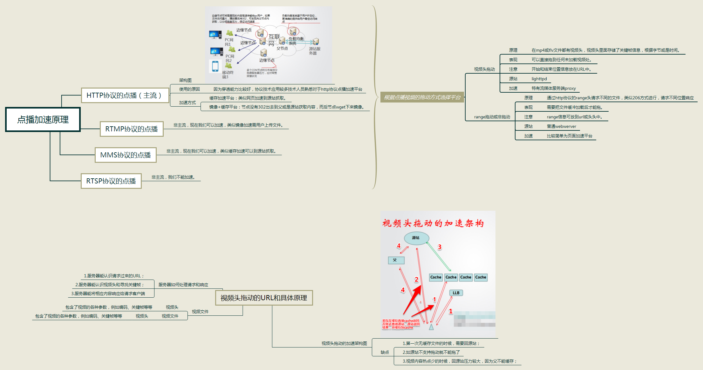
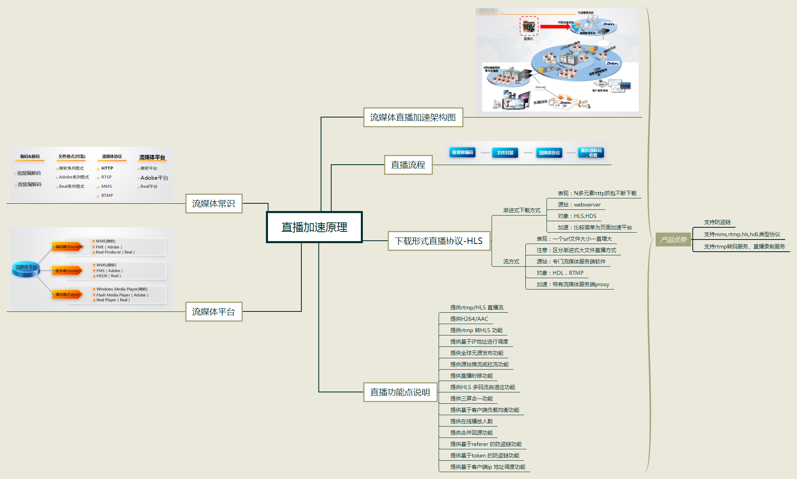
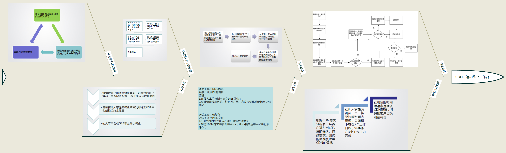

# CDN
工作总结，文档备份

# CDN基础详解

# CDN页面加速详解

# CDN下载加速详解

# CDN点播加速原理

# CDN点播加速原理

# CDN开通和终止工作流

# 2017/8/9
* 提交岗前培训资料，备份。
* 添加点播加速原理图
* 添加直播加速原理图

# 2017/8/10
* 添加CDN开通和终止工作图

# 2017/8/22
* 添加CDN技术详解
* 添加帝联数据采集API文档
* 添加帝联后台说明书